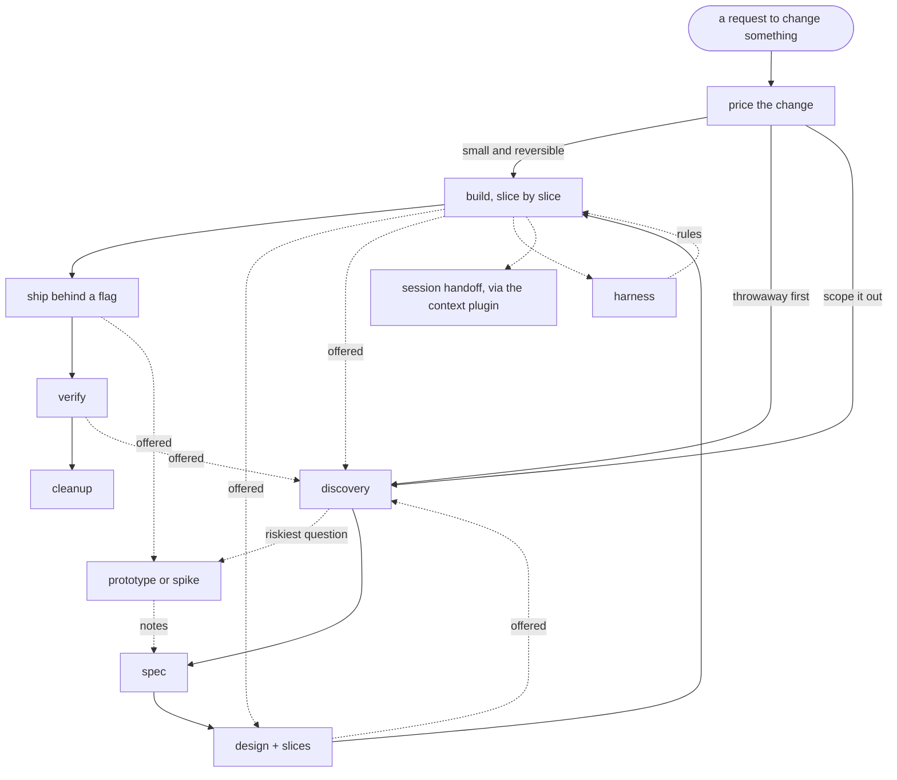

# build like an engineer

**Well-understood engineering practice, run *with* you by an agent rather than recited at you.**

None of this is new. Framing the problem before solving it, stating the contract before building against it, walking how a thing breaks by accident and then on purpose, knowing what you cannot undo: this is ordinary engineering discipline and most of it predates the tooling by decades. What is new is an agent that can hold all of it at once and walk it with you.

The workflow is derived from two podcast episodes, and most of what is specific rather than generic in here traces back to one of them:

- **[Florian Buetow on Beyond Coding](https://www.youtube.com/watch?v=W1uG25of2t0)** with Patrick Akil, 10 June 2026. Code review as the bottleneck once agents write the code, and shaping the environment so corrections become rules instead of repeat conversations.
- **[Dex Horthy on The Pragmatic Engineer](https://www.youtube.com/watch?v=Usufn8IQJgw)** with Gergely Orosz, 15 July 2026. Context engineering, why prose specs drift out from under you, and slicing sized to what a human will actually read.

The plugin is nine skills. Plain Markdown, no build step, nothing to compile.

| Skill | Fires on |
|---|---|
| `agile` | any request to change a system, at any stage: "add X", "what's the best way to Y", "build the next slice", "did that fix it" |
| `orient` | "orient yourself", "setup claude in this repo", "get this repo ready for agents", "write the charter", "write AGENTS.md" |
| `test-table` | "what tests should this have", "propose the tests", "is this covered" |
| `review` | "review this", "review the diff", "what can be deleted" |
| `spike` | "prototype this", "let's see if X is feasible", "throwaway" |
| `greenfield` | "start a new project", "walking skeleton", "scaffolding" |
| `give-feedback` | "give me feedback", "what do you think of this", "poke holes in this", "here is how I would fix it, thoughts?" |
| `harness` | "set up guardrails", "add hooks for the agent", "set up the commit gate" |
| `adr` | "write an adr", "let's document that decision", "we'll accept that risk" |

Session handoff, once part of this plugin, now lives in the separate [context](../context/) plugin. The `agile` loop still offers a handoff when context runs low; installing `context` is what fulfils it.

`agile` carries the whole change loop. It used to be six skills, one per stage, and collapsing them was a bet: that a capable model needs orientation rather than a numbered walk, and that most of the length was telling it things it already knew. The bet paid off. What is left is the part it would get wrong by default.

## Three convictions

**Most things do not need to be built.** Every feature is a permanent liability with a running cost. So discovery asks what known category of problem the need belongs to, and if the category already has an answer in this system or off the shelf, that is the answer. "Do not build it" is a real outcome, and it is the one decision discovery writes down as an ADR, because no later stage runs to catch it.

**Most requests are not well thought through, including the ones that sound settled.** A decided-sounding one-liner is the normal shape of an unsettled ask. Requests arrive naming a mechanism instead of a need. So the first move is reading the request, not answering it.

**The failing test is the unit of account.** A settled constraint becomes a complete failing test before any implementation exists, and that does not scale with the size of the change. A one-line fix still gets a test.

---

# The workflow



Dotted edges are offers, not moves. A hand-back is always put to the human.

## Pricing the change

The first pass works out where the change should enter, and it hands straight on. It asks which kind of change this is, because that decides what the risky question even is:

| | riskiest question |
|---|---|
| greenfield | does anyone want it |
| new feature | does it fit the system |
| replacement | what will it break |

Replacement changes the most: it gets its own reference file, loaded at this point, covering characterization tests, the migration section, shadow mode and a cleanup stage that stops being optional.

Then it scouts the change, in a subagent, asking what is in the path, what breaks if this is wrong, and what it costs to undo. It judges on blast radius and reversibility, never on line count. A two-line change to an auth check is not small.

Three routes, and the user picks:

- **Just implement.** Only when the blast radius is small and the change is reversible.
- **Throwaway first.** A prototype or a spike, then discovery. For a change that warrants a spec where nobody yet knows what the spec should say.
- **Scope it out.** The default, and the answer whenever the scout was uncertain.

The test between the last two is certainty rather than size: can the user say what done looks like from outside the system. If they would be guessing, the throwaway is cheaper than a spec written from a guess.

The just-implement route drops the documents. It does not drop the failing test, and it does not drop the failure-mode check: the constraints come from the conversation instead, and they are still named back to the user with their testable output and their reason before any test is written. It is never offered for a change that removes a feature, alters a stored data shape, touches authentication or authorization, moves money, or changes anything another team calls.

## The throwaway: prototype or spike

Both are disposable, and which one you want depends on what the risk is.

**A prototype** answers "what do we actually want", and suits greenfield. Build fast, do not interrogate the request, do not write tests, do not add linters or refactor or raise the architecture. All of that constrains a shape nobody has settled. When the user changes direction, change direction: that is the request working.

**A spike** answers "does this fit" or "what will it break", and suits an existing system. It runs against real data in a worktree, and it is done when the change has a price rather than when the code works. The gap is almost always the schema rather than the UI. Reading code and tracing one request end to end counts.

A spike for a replacement writes **characterization tests** capturing what the system does today, including the things it does wrong: the bug is documented as a passing test and left unfixed, so a later intentional change stays distinguishable from an accident. That is the one throwaway output that is not thrown away, and it carries into the manifest as rows.

The code is disposable. The notes are not, and they are written **as the session runs**, starting at the first direction change, or at the end where there is never one. By the end the early reversals are gone, and those are the most valuable thing in the session.

Discovery reads the notes as input, not as conclusions. It takes where it landed as the request rather than what was first asked for, treats constraints found as candidates to confirm, treats what fought back as hazard candidates, and puts rejected directions straight into out-of-scope. Where the notes contradict what the user now says, it surfaces that and lets them settle it: the notes are older than the conversation.

## Discovery

Discovery runs **before** the throwaway, because a throwaway is worthless until you know which question it has to answer. That ordering is the one thing most workflows get backwards.

The stated ask is a proposed solution, not a requirement. "Add an email notification" is a mechanism; "know when this job finishes" is the need. It gets to one sentence: who has the problem, how often, and what they do today instead. Everything downstream is checked against that sentence.

Then the category of problem, along with the constraints and failure modes it brings. If the category already has an answer in this system or off the shelf, that is the answer. Where the user agrees not to build it, that decision gets an ADR, because nothing downstream runs to record it.

In an existing codebase it searches the code and the backlog first. There is usually a half-built version, an abandoned branch, or a manual workaround somebody's best user invented, and it is the cheapest spec input available. For a replacement the evidence is tickets, logs and analytics rather than interviews.

Discovery is not a gate you pass once. The problem statement goes at the top of every spec, design doc and slice, and gets re-read at the end of each. The stated request masks the real need at every stage, in a different costume each time.

## The spec

Before writing anything, the code in the path is surveyed in parallel subagents, without saying what is being built, because naming the change biases the survey toward it. That survey goes to the system temp directory, never into the repo, and nobody reviews it.

Then the interrogation: generate twenty questions without asking any, keep the ones where being wrong is expensive to discover or expensive to reverse, drop the ones you would notice within minutes of running the code, then go relentless on what survives. One question at a time, pushing past the first answer. A question recorded in the spec but never put to the user was not asked.

Two lists come out of that, both confirmed as they are built. **Acceptance criteria**, observable from outside, each naming how it is observed. **Constraints**, each a testable output plus the reason it holds. "Fast" is neither; "p95 under 200ms, because the caller times out at 250" is both. The bar for admitting one is high on purpose: every constraint becomes a test asserting that exact number at a boundary and a promise the design has to keep, so a row that cannot say what breaks if the number is wrong, and who notices, is a preference and stays out. A missing constraint surfaces at design or build and gets added. An invented one is never questioned again. Two counts catch a spec that has drifted: more constraints than acceptance criteria means it bounds more than it builds, and more constraints the agent proposed than the user raised means it is a spec you agreed to rather than one you wrote. Then it asks outright for the ones only the user knows: external limits, compliance rules, commitments already made to someone else.

In an existing system the spec also says what changes for what is already there, and what state existing records start in. For a replacement, the migration section runs longer than the feature section.

The spec goes to `docs/spec/{slug}/spec.md`. A spec, not a design: "callers over the cap get 429 with Retry-After" belongs in it, "token bucket in Redis" does not. Three sections carry the weight and a spec missing any of them is not finished: **Constraints**, each with an origin; **Adjectives not yet priced**, every word from the request that sounds like a limit and has no number yet; and **Open questions**, each with the fallback that applies absent an answer.

The questions go to the user. They do not get answered on the user's behalf. A spec that comes back with no hard question papered over the ambiguity.

**Then the spec is reviewed, and not by whoever wrote it.** Four passes: mechanism that leaked in, which is either an outcome badly stated or a decision nobody has taken; contradictions between rows, including a criterion that rests on something the out-of-scope list excludes; rows below the bar, such as a constraint with no origin or an open question that has quietly acquired an answer; and anything the request said that the spec no longer contains. Every finding goes back as a proposal with the replacement already written. The user settles each one, because a spec corrected quietly is a specification nobody agreed to.

## The design

**Gather what binds the change.** Four sources merged into one list: the spec's constraints; what the code already meets, with the file each comes from; what a throwaway found, as evidence rather than a proposal; and what the code imposes on anything new. That fourth is the interesting one. Frozen interfaces and how many callers they have, boundaries the architectural tests enforce, a transaction scope anything inside it inherits, a delivery guarantee that forces handlers to be idempotent. It usually removes options rather than adding them.

**Triage the failure modes**, marking each applies or does not with a line for each that does not. Those that apply become failure paths, and a failure path carries a **detector** rather than a disposition, because a wrong value is caught by a test and a silent stop is caught by an alert that has to exist in production.

**Build the constraint-to-test manifest.** Every constraint and acceptance criterion lands with one of exactly three dispositions, and there is no fourth: **test**, naming the kind and what makes it fail; **held by existing check**, naming the rule, guardrail or CI job; or **no test**, and why nothing can reach it. Every row carries its origin written out, because provenance has to survive into the tests without a legend.

**Derive the decisions**, working from the constraint list rather than a catalogue of patterns. A constraint that admits one mechanism is not a decision. They are ordered so the one holding the tightest constraint goes first, put to the user one at a time, and re-derived after every answer rather than worked to the bottom of a fixed list. Expensive or irreversible decisions get their ADR at the moment they are made: by the end, the alternatives that lost are gone.

Two things get drawn, not described. First the module shape: what is in the path, what each part owns, which way the dependencies run, what crosses each boundary. Then, once the approach is settled, the level below it: **the classes and interfaces this change adds or reshapes**, the methods and fields that matter, and which of them call, implement or hold which. That second picture is handed over for the user to move, rename, merge or split before any of it exists in code, which is the cheapest moment it will ever be to change.

Both go into the design doc as diagram source rather than being drawn once in the chat, and every slice redraws them with its own additions marked. The last redraw is what extends the architecture map, since the design doc is deleted at the end. A third diagram, the states and transitions, is drawn only where the change introduces a lifecycle.

**Dependencies are decided, not accumulated.** The design doc carries a table of every capability the change needs and what provides it. The standard library is the default, so a row exists to justify anything else: what it buys, pinned to which version, and what removing it would cost. A row that cannot answer the third of those is a dependency nobody needs yet.

**Both documents are written for somebody who was not in the conversation.** Each opens with a glossary of the terms that carry a specific meaning here, one sentence and one real example value each, because two people using one word for two things is the failure that survives all the way to production. Each table carries a filled example row, and each document holds one voice throughout rather than drifting between "the handler retries" and "we would have the handler retry".

**The spec is never edited unilaterally.** The design review re-verifies every spec row against the code and the running system, and every verdict other than "holds" is a *proposal*: a constraint the code contradicts, a number that measured differently, an acceptance criterion the design cannot satisfy, two constraints that turn out to conflict. Each goes to the user with what was found and what it would mean, and waits. Correcting one quietly is how a change ends up meeting a specification nobody agreed to.

The review itself runs in a subagent that did not write the design, or the human runs it, and which one happened is stated. Anything the approach rests on that nobody has verified is checked now or marked UNMEASURED.

**The design doc leaves no room for ambiguity.** Where it names an algorithm, a strategy or a pattern, it explains how that works here, on this data, at these boundaries. Naming one and stopping is a gap, not a shorthand.

**Cut the slices for review**: at most 400 lines of new logic per slice, which is what one person reads in a single pass. File moves, migrations, renames and deletions do not count against it. The manifest rows are spread across the slices, and a row no slice carries is a gap surfaced now. A small change is one slice and says so. Cleanup is a slice, and it is the last one.

The design doc goes to `docs/design/{slug}/design.md`, and **the slice list lives in it**, because it carries which manifest rows each slice is responsible for and git cannot reconstruct that.

## Building, one slice at a time

Before the first test, it checks what feedback the repo already gives an agent: formatter, linter, type checker, test runner, and something that runs them at commit time. Where those are missing it offers `harness` first, because building without them means every correction arrives from a human who had to notice it.

Then the run is agreed once, and the branches are set up. The feature branch is `feature/{slug}` and is the unit that has to run and the unit that ships. Each slice branches off it as `slice/{slug}/1-mock-endpoint`, and a slice branch only has to be reviewable. The two namespaces are separate because git stores refs as paths: `feature/{slug}` and `feature/{slug}/1-mock-endpoint` cannot both exist. The test baseline is recorded once; pre-existing failures are out of scope and carry forward.

Then, per slice, in this order:

1. **Failing tests first**, only for the manifest rows this slice carries. Each is a full arrange-act-assert with real inputs, the real call at the boundary, and an assertion on a concrete outcome. A constraint's test asserts the recorded number at the boundary its source enforces: not rounded, not widened, not the behaviour near it. Each docstring records what it discharges **in words** and what settled it, because the manifest gets deleted and "discharges row 7" points at nothing.
2. **Confirm they fail**, and that they assert real values rather than mocks. Whoever wrote them does not run that check.
3. **Lock and implement.** Where the harness allows it, the test directory is blocked for writes so the implementation cannot alter the contract. Then the most boring solution that satisfies the tests. No test is modified. Disabling a guardrail, weakening an assertion or marking a test skipped to reach green is not a fix.
4. **Review**, never self-audit, in a subagent that did not write the code, or by the human, and which one happened is stated. Then read the diff and ask the agent why it made the calls it made. Any answer that does not survive the question is a **candidate rule**, and a candidate rule is written before the next slice starts, so the next slice runs under it. Where the new rule covers a manifest row, that row moves to "held by existing check". That is the only thing that takes human checkpoints *off* a change rather than adding them.
5. **Run it.** Unlock the tests, strip the expected-failure markers, re-run the full suite, and show the slice working.
6. **Tour it.** One screen of prose at most, next to the diagrams, coarsest first: the shape redrawn with this slice's additions marked, one load-bearing path traced end to end from entry point to effect including how it fails, and which file to read first. This is the answer to comprehension debt, where code ships faster than anyone can understand it and nobody finds out until something breaks.
7. **Check the tour landed.** The agent picks two or three blocks the slice added and asks the user to explain back what they do. A miss means the tour was wrong, not the user, so it is fixed and asked again, and the slice does not close until they can. This is the review-time comprehension check with the roles swapped: the agent wrote the code, so the human is the reviewer. It runs per slice, never saved for the end of the feature, because by then there is too much to hold at once.
8. **Close the slice.** Merge into the feature branch, update the task handoff, offer to clear the session, then **ask what building it changed about the slices still to come** and update the slice list.

Where the harness allows it, each slice uses three subagents: one writes the failing tests, one implements, one reviews. The implementer never wrote the tests it satisfies and never reviews its own code. The separation is the point rather than the parallelism, because an agent that already knows how it intends to implement something writes tests shaped around that implementation instead of around the constraint. They share the slice's working tree, because the implementer has to read the tests and a reviewer that cannot see the diff reviews nothing. Isolation belongs one level up: two independent slices running at once get a worktree each.

## Shipping, verifying, cleanup

**Ship progressively** wherever the change can break something, widening in steps you can stop at: yourself, a cohort who agreed to it, a percentage, everyone. The flag is the rollback. One that needs a deploy does not count, and one nobody has exercised is a plan. For a replacement, both paths run and get compared in shadow mode first, and you widen when the discrepancy rate stops falling.

**Verifying** is usually a separate session, days later. It confirms each detector actually fires in production, because a detector nobody has seen fire is not a detector. Then it takes every manifest row dispositioned "no test" and every hazard accepted without a detector, and either shows the live measurement that proves it holds or says plainly that nothing measures it. Nothing else in the loop ever visits those rows. Then it reports which of three happened: production matches the model, differs in a way the model allows for, or contradicts it.

**Cleanup** is the step everyone skips, and skipped twice in a row it produces the codebase you started with. Everything the change opened gets closed: the flag and the code it gated, the old path, the dual-write, the shadow comparison, the migration script, the manual workaround the feature replaced. It is gated on verification rather than the calendar, and it is a change like any other, so it is the last slice: removing a covered code path takes its test with it.

---

# What you end up holding

| Artifact | Where | Fate |
|---|---|---|
| Prototype or spike notes | wherever the user says, never in the throwaway's own directory | outlive the throwaway, read once by discovery |
| Characterization tests | the repo's test tree | durable, and the one throwaway output that survives |
| Code survey | the system temp directory, one file per area | scratch, never committed, never reviewed |
| Spec | `docs/spec/{slug}/spec.md` | deleted after the last slice |
| Design doc and slice list | `docs/design/{slug}/design.md` | deleted after the last slice |
| Task handoff | `docs/design/{slug}/task-handoff.md` | deleted with the design doc; committed where several people work the slices |
| ADR | `docs/adr/{slug}/` | durable, committed |
| Failing tests | the repo's test tree | durable |
| Rules and architectural tests | the repo | durable, and added to at every slice |
| Session handoff | `docs/agents/handoff/YYYY-MM-DD-NNN-slug.md` | read by the next session |

There is no config file. Those paths are the defaults; tell the agent in conversation if your repo keeps things elsewhere.

The spec and the design doc are not committed at all unless a gate opens a merge request for one. Four points are offered and none is assumed: the spec alone, the ADRs and design doc, the failing tests before any implementation, and each finished slice.

## Why the split exists

Everything durable is written in a language that can be checked. Everything written in prose is thrown away after the feature ships.

Prose and code become two sources of truth and drift apart. A rule that executes cannot drift, because a violation fails the build. So the constraints the prose carried are promoted into tests, guardrails and architectural tests, and the prose itself goes.

The ADR is the exception, and it is one for a specific reason: it makes no claim about what the system currently does, so there is nothing for it to drift from. It says what was true at a moment and why a door was closed. What it records, the alternatives that lost and the assumptions the decision rests on, is not recoverable from the code and cannot be regenerated the way research can.

**Nothing ephemeral is deleted until its durable content has a home.** The design doc ends with a checklist that has to be worked before it can be deleted: every manifest row is discharged by a passing test, a named existing check or a recorded reason, every open question is closed or promoted to an ADR, every measurement is inside the ADR that rests on it, every permanent gap is duplicated into an ADR, every module's ownership line is in that module's docstring. Only then do `docs/spec/{slug}/` and `docs/design/{slug}/` go. The tests, the rules and `docs/adr/{slug}/` stay.

This is also why the tests carry their provenance in a docstring. The reason a number is 100 rather than 150 has to survive the deletion of the document that settled it.

## The loop back

A checklist run front to back is waterfall with better vocabulary. Four edges run the other way:

- design back to discovery, when the design puts the original ask in question
- building back to design, when a test exposes a contradiction in the design
- building back to discovery, when a finished slice shows the original ask was wrong
- verifying back to discovery, when production contradicts the model

Every one of them is **offered to the human, never taken**. Going backwards is not failure. Discovering in production what discovery assumed is.

The per-slice question at the end of each slice is the shortest of these edges: what did building this change about the slices still to come. Without it the loop is merely chunked.

---

# The two skills outside the loop

**`harness` prepares a codebase.** It runs before feature work, not as part of it. It reads what exists rather than assuming a fresh project, then branches on greenfield or brownfield, and the branch is not project age: a two-week-old repo with a thousand lines and no linter is brownfield.

It is language agnostic, and deliberately carries no toolchain. It names eleven slots, states what a filled slot has to do and which of the three layers it fires in, and leaves the choice of tool to the model, which already knows the ecosystem. What it does carry is the part the model would otherwise get wrong: the placement rule, in seconds, for which layer a check belongs to; the settings that are decisions rather than defaults, each with a silent failure mode; and the requirement to watch a check fail once before trusting it.

Greenfield runs forward: get the dependency shape from the user, encode every allowed-dependency line as an architectural test, then set up the rest of the checks. It does not work out what the system should be, and where the shape is still open it encodes the language-level checks now and comes back for the architectural tests once the first change has settled it. Brownfield runs the same ground in the opposite direction: fill the slots, then have the agent draw the current dependency graph and encode the edges that surprise you, because those are the ones nobody chose, and only then name the anti-patterns already in the code and write rules for them. Encoding the whole current graph makes the mess permanent.

Both paths end at the same place, a feedback loop split across three layers by cost: format and lint on every edit, whole-package checks at turn end, everything at commit and in CI. Each layer is a subset of the same command list, so what gets fixed at edit time is never rediscovered at commit time. The loop safety is wired before the checks: a retry counter, re-verification after each fix, a skip when nothing relevant changed, and failing open when a checker cannot run. A blocking check with no escape traps the agent on an error it cannot fix.

Three things go into the instructions file before any correction has been made, because none of them shows up in a diff. That silencing a check is not passing it, which goes in verbatim, because the pressure to loosen a config is created by the gate this skill just installed. Where a future correction is meant to land: a static check into the rules directory, a dependency direction into the contracts, a file-specific instruction into a path-scoped rule, anything conversational into the root file. And an answer-length rule, offered rather than imposed, since that file is the user's.

An instruction that governs the conversation is never path-scoped, since path frontmatter would load it only when a matching file is touched. The root file is capped at 100 lines, because every line in it costs context on every turn and a bloated one makes the agent ignore the rules that matter.

Brownfield gets one thing greenfield does not, and it is a decision rather than a step. Every rule just added is violated by code that predates it, so enforcement is either scoped to files authored from here on, or the backlog is cleaned up as a change of its own. Both are real answers. Adding rules and leaving them red is not.

**`adr` records one decision.** It is a skill rather than a section because the trigger is a moment, not a stage: an expensive or irreversible choice, an accepted hazard, or an explicitly rejected alternative. `agile` invokes it the moment the decision is made rather than batching records at the end, by which time the alternatives that lost are gone. Its template forces `Rejected` and `Assumes` to be filled, because an ADR with no rejected alternative recorded a preference rather than a decision. Recording decisions is not one of `harness`'s outputs.

**Session handoff moved out of this plugin.** It now lives in the [context](../context/) plugin as the `handing-off` skill, writing `docs/agents/handoff/YYYY-MM-DD-NNN-slug.md` with the dead ends a fresh session would otherwise rediscover. `agile` offers a handoff once context starts filling; installing `context` is what fulfils it.

That session handoff is not the same document as the **task handoff**, which is SDLC's own and lives beside the design doc at `docs/design/{slug}/task-handoff.md`, scoped to finishing one slice. That one carries what would cost the next agent an hour to rediscover and nothing else: the workaround and what forced it, the test that fails for an unrelated reason, the dependency that behaves differently from its documentation. Not a progress report, because the slice list already says what is done. It goes with the design doc when the last slice merges.

---

# Why not a prose spec

This started as an attempt to address the shortcomings of spec-driven development, where planning and specification are done up front and reviewed before being handed to an agent to implement.

A lot of people call that waterfall in disguise. I don't fully agree, but the pitfalls are real:

- A spec does not guarantee results. Hand the same spec to different models and get different implementations. The spec becomes an aspiration, not a contract.
- Reviewing a spec takes more cognitive effort than reviewing the code it produced. It is easier to read the diff and run the tests than to match every requirement to the code it was supposed to produce.
- A thousand-line Markdown file gets produced for a twenty-line change.
- Specs go stale quickly and confuse the agent. A detail that was relevant at authoring time is still there three features later, and the agent anchors on it as a constraint.
- A hundred specs sitting in a repo have to be read manually to avoid contradicting them.
- Most spec frameworks are heavy on ceremony, unfriendly to brownfield, and awkward to work with in an agile fashion.

We already have specs. They are tests. Deterministic pass or fail, and they do not lie about the code. What they cannot carry is the **why**, and that is what the ADR is for.

## Where tests stop

A behavioural test binds what the system does at one moment. It cannot fail when the design decays, because decay has no wrong answer on the day it is introduced. The imports still resolve, the suite still passes, and the bill arrives three months later as a change that touches nine files instead of one.

So the manifest has three dispositions rather than one. Behaviour gets a test. Structure gets a rule that executes: dependency direction, boundary membership, ownership, a budget, wired through whatever the repo already runs. And the rows nothing can reach are written down as exactly that, named as permanent gaps, and checked against production when the change is verified.

That leaves the decision itself, which neither reaches. The ADR's `Assumes` field carries it: what must stay true, and what would make this wrong. That is the trigger for revisiting. A test asserts that one hop of delegation works; only the ADR says that one hop was an assumption rather than a requirement.

## What the research says, including where it disagrees

Some of this is better evidenced than I expected, and some of it cuts against the idea. Both are here.

**"Tests don't lie" is too strong.** Tests encode whatever the spec says, *including its errors*, and they do it invisibly. Mund et al. injected one subtly wrong requirement into a real 21-page industrial spec and asked 41 people to derive test cases from it: **zero detected the defect and zero correct test cases were produced**, even in the group given a briefing that stated the correct behaviour. Tests don't lie about the code. They will happily lie about the intent.

**Deriving expected values independently is not a style preference.** It is what aviation certification requires, and DO-248A states the mechanism: "It is a natural tendency to consider outputs of the actual code as the expected results. **This bias cannot occur when expected outputs are determined by analysis of the requirements.**" Using the code as the oracle contaminates the oracle. The same document concedes that requirements-based testing cannot evidence the absence of *unintended function*, which is why the review reads the diff for what crept in rather than trusting a green suite.

**The honest limit on absence.** A test refutes; it cannot confirm. Refuting a safety property ("X never happens") takes one failing execution; confirming it means quantifying over every execution there is. That is a proved result, not a budget problem, and it is why "no unauthorized path" ends up as a permanent gap checked against production rather than a test that pretends to settle it.

**The biggest risk to this approach is staleness, and it has a number.** In a study of Ruby projects, executable scenarios and production code co-evolved in only **~37%** of cases, and where they did, the spec changed *after* the code. A green test suite is indistinguishable from a suite full of requirements that expired. That is what the ADR's `Assumes` field exists for: a constraint with no recorded invalidation condition dies in silence while the tests keep passing.

**The closest thing to prior art mostly failed, and it is worth knowing why.** Specification by Example is the same bet, and Gojko Adzic's own ten-year retrospective (514 respondents, recruited from his advocacy channels) concluded that "the idea of specifications and tests in a single document didn't really work out." Only 12% kept text files in version control as the source of truth; 26% of business representatives "mostly do not care about the examples"; 61% of BDD practitioners in a separate survey found duplication made specs hard to extend. But read what failed: a **separate natural-language layer** maintained alongside the code for stakeholders who turned out not to read it. That layer is the thing this plugin deletes. The finding that only 12% kept the living document in version control is, if anything, evidence for the choice.

**And the ceiling that applies to everyone.** Naur: "program revival, that is reestablishing the theory of a program merely from the documentation, is strictly impossible." That applies to prose specs exactly as much as to tests. So the claim here is not that tests capture what prose cannot. It is that **these two artifacts fail differently**, tests rotting loudly and prose rotting quietly, and neither one reconstitutes the theory in someone's head. The ADR is a hedge against one failure mode, not a solution to the problem.

**One thing to hold this methodology to.** Every reported failure of BDD gets answered with "that isn't BDD, you did it wrong." A technique whose failures are always the practitioner's fault has no failure conditions, so no evidence can ever count against it. If this approach costs you more than it returns, that is a result about the approach.

## Where the workflow itself comes from

The stage structure is derived in `research/combined-development-strategy.md`, which merges the two episodes linked at the top:

- Florian Buetow on **Beyond Coding**, 10 June 2026: [YouTube](https://www.youtube.com/watch?v=W1uG25of2t0), [Pocket Casts](https://pca.st/episode/ab84ca98-407b-4445-b08b-2d7e31c12a30)
- Dex Horthy on **The Pragmatic Engineer**, 15 July 2026: [YouTube](https://www.youtube.com/watch?v=Usufn8IQJgw)

Every line there states why it is in, and the two conflicts are resolved at the point they arise. Transcripts and derivations live in `research/`, which is never loaded by any skill. Neither guest had anything to do with this plugin, and any misreading of them is mine.

Both arrive independently at the same structural claim, that feature work and environment work are separate projects running in parallel. That is why `harness` is a skill of its own rather than a step in the change loop.

The two conflicts are worth naming because the resolutions shaped the skills:

- **Does a human read the code?** Buetow says interrogating the agent can replace reading it. Horthy ran the lights-off version for four months and shut it down, with a specific bug and a recovery cost. Resolved toward Horthy: the interrogation stays as the way new rules get discovered, the substitution does not. This is why slices are cut to what one person reads in a single pass, and why the review is never self-audit.
- **Do the documents persist?** Buetow keeps specs; Horthy throws them out because prose and code become two sources of truth. Resolved toward Horthy on prose and toward Buetow on rules: the prose is deleted and the constraints it carried are promoted into things that execute.

`research/example_artifacts.md` is the companion, showing what each artifact looks like and how long it lives.

Neither source covers what happens when a feature is removed, what to do when a feature needs a boundary you drew wrong, or when to retire a rule that has stopped earning its slot. Those gaps are still open.

## Where the hands go

The split between what the user does and what the agent does follows how an airline crew works with an autopilot. The pilot hand-flies the takeoff and the landing and sets the autopilot's targets for the cruise; the autopilot never chooses the altitude. In the loop, the user writes the cards and the acceptance criterion, cuts the test rows, writes the merge description and merges. The build runs unattended in between.

Four findings from that field shaped specific rules:

- **Bainbridge, "Ironies of Automation" (1983).** Automation takes the routine part of a task and leaves the human the hard part, with less practice at it. FAA SAFO 13002 (2013) asks airlines to schedule manual flying so the skill stays current. The practice is the user writing code, a design or a fix idea by hand and running `give-feedback` on it; the `agile` loop never forces it, since a forced exercise in the middle of a delivery is an interruption, and the loop is for delivering.
- **Asiana 214 (NTSB, 2013).** The crew flew an approach assuming the autothrottle held speed while it sat in a mode that did not. This is why the proposal lists what it assumes before the build, for the user to strike or confirm.
- **Air France 447 (BEA, 2009).** The autopilot handed a stalling aircraft to a crew that had been monitoring for hours, with no statement of what it had stopped doing. This is why every stop in the loop ends with the branch, the last commit, which tests are red and what the agent does on "go".
- **The stabilized-approach gate.** An approach that fails fixed criteria at a fixed height is abandoned without debate. This is why a builder that reports red, or touches a path outside its slice, is reset to the red commit and reissued once, and the slice is split after the second failure.

---

# How it runs

Say what you want in ordinary language.

- **Anything that changes a system**: "add X", "fix this bug", "remove the Y feature".
- **Half-formed**: "I'm thinking about Y", "what's the best way to Z", "should we move to A".
- **When nobody knows yet**: "just build me a quick version", "I want to try something".
- **Mid-flight**: "write the tests for this", "build the next slice", "review my diff".
- **After it ships**: "we shipped X, is it working".
- **On a repo with no guardrails**: "get this repo ready for agents".
- **At a session boundary**: "write a handoff", "I'm running low on context".

Judgment calls go to you. The skills surface the decision, the failure mode or the coverage gap concretely, and you disposition it. The model does not decide for you, and where you ask it to choose it says what it would pick and marks that as its read rather than the answer.

**Every sentence has to earn its place by one test: does it change what you do next?** That cuts the preamble announcing what is about to happen, the derivation behind a result you can take on trust, the reasons you supplied in the first place, and the second argument for a point the first already carried. The answer leads, the question closes. Several findings arrive as one line each, for you to pick which to open, rather than being worked through in order. A document or a diff that was just written is named and located rather than reproduced. The pictures are the exception to the volume rule: those go up, not down.

**Subagents get the cheapest model that can do the job, named when they are launched.** Bulk mechanical work goes to a small one. The failing tests, the design review and the implementation review do not.

# Installing

**Claude Code:**

```bash
/plugin marketplace add DaveBben/davebben-skills
/plugin install SDLC@davebben-skills
```

The nine skills surface under their own names.

**Any other agent** (Codex, Cursor, Windsurf, and more), via the [`skills` CLI](https://github.com/vercel-labs/skills):

```bash
npx skills add DaveBben/davebben-skills --skill agile
```

Swap in `harness` or `adr`, or `--all` for every skill in the repo. The canonical `SKILL.md` files live at `skills/SDLC/` in the repo root.

MIT.
