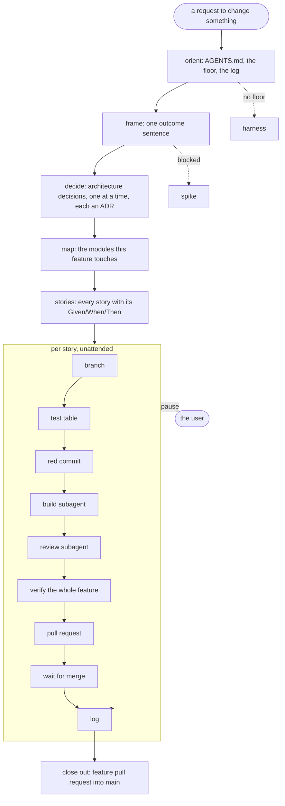

# build like an engineer

**Well-understood engineering practice, run *with* you by an agent rather than recited at you.**

None of this is new. Framing the problem before solving it, stating the contract before building against it, walking how a thing breaks by accident and then on purpose, knowing what you cannot undo: this is ordinary engineering discipline and most of it predates the tooling by decades. What is new is an agent that can hold all of it at once and walk it with you.

The workflow is derived from two podcast episodes, and most of what is specific rather than generic in here traces back to one of them:

- **[Florian Buetow on Beyond Coding](https://www.youtube.com/watch?v=W1uG25of2t0)** with Patrick Akil, 10 June 2026. Code review as the bottleneck once agents write the code, and shaping the environment so corrections become rules instead of repeat conversations.
- **[Dex Horthy on The Pragmatic Engineer](https://www.youtube.com/watch?v=Usufn8IQJgw)** with Gergely Orosz, 15 July 2026. Context engineering, why prose specs drift out from under you, and slicing sized to what a human will actually read.

The plugin is nine skills. Plain Markdown, no build step, nothing to compile.

| Skill | Fires on |
|---|---|
| `agile` | any request to change a system, at any stage: "add X", "what's the best way to Y", "build the next story", "did that fix it" |
| `orient` | "orient yourself", "setup claude in this repo", "get this repo ready for agents", "write the charter", "write AGENTS.md" |
| `test-table` | "what tests should this have", "propose the tests", "is this covered" |
| `review` | "review this", "review the diff", "what can be deleted" |
| `spike` | "prototype this", "let's see if X is feasible", "throwaway" |
| `greenfield` | "start a new project", "walking skeleton", "scaffolding" |
| `give-feedback` | "give me feedback", "what do you think of this", "poke holes in this", "here is how I would fix it, thoughts?" |
| `harness` | "set up guardrails", "add hooks for the agent", "set up the commit gate" |
| `adr` | "write an adr", "let's document that decision", "we'll accept that risk" |

Session handoff, once part of this plugin, now lives in the separate [context](../context/) plugin. Plugins are independent, so nothing in SDLC calls it; install `context` to have it.

`agile` carries the whole change loop. It used to be six skills, one per stage, and collapsing them was a bet: that a capable model needs orientation rather than a numbered walk, and that most of the length was telling it things it already knew. The bet paid off. What is left is the part it would get wrong by default.

## Three convictions

**Most things do not need to be built.** Every feature is a permanent liability with a running cost. So framing asks what the user will do differently once this ships, and when the answer is already possible in this system or off the shelf, that is the answer. "Do not build it" is a real outcome, and it is recorded as an ADR, because no later step runs to catch it.

**Most requests are not well thought through, including the ones that sound settled.** A decided-sounding one-liner is the normal shape of an unsettled ask. Requests arrive naming a mechanism instead of a need. So the first move is reading the request, not answering it.

**The failing test is the unit of account.** A settled constraint becomes a complete failing test before any implementation exists, and that does not scale with the size of the change. A one-line fix still gets a test.

---

# The workflow



Two phases. The first runs with you, once per feature. The second runs without you, once per story, and stops only on a short list.

## With you, once per feature

**Orient.** The agent reads `AGENTS.md`, checks the repo gives it feedback of its own (a check command, a suite green on main, a mutation runner), and offers `harness` when it does not. When a log exists it tells you in one line what the last story changed, and reads every `Learned` line before proposing anything.

**Frame.** One sentence: what you do differently once this ships, and where you see it. A sentence naming a table or an endpoint is rejected, since it is true when the work is half done. The feature branch is `feature/{slug}`. A spike runs only when a fact about the world blocks the criterion, and its code is deleted.

**Decide.** Some choices touch the data's shape, the trust or consistency boundaries, or the platform, and are expensive to reverse. The agent walks a list of those for this kind of system, states which the code already settles, and puts the rest to you one per message. Each answer becomes an ADR before the next question, and `adr` asks you why, what the tradeoffs are, and why not the obvious route, then gives its own feedback, before it writes anything. A choice that can wait goes on the feature header as deferred, with the story that will force it.

**Map.** One table of the modules this feature touches: what each owns, what it depends on, and a pattern where you have one. It is not a design document. It goes into `AGENTS.md` with the first story, and every build prompt cites the module the story lives in and what it may import.

**Stories.** Every story the outcome needs, each with one Given/When/Then acceptance criterion, in one message. You confirm, reword, cut, add or reorder in one turn. No estimates. The result is the feature header at the top of `docs/features/{slug}/feature.md`. When `AGENTS.md` names a Jira project or another tracker, the board is the backlog instead: the epic is the feature, its children are the stories in rank order, stories already on the board are read as the proposed list, and every log entry is a resolution comment. No `feature.md` is kept then.

**feature acceptance test.** Every story has its acceptance test, written by the agent. You write one more for the outcome sentence itself, through the front door, marked expected-to-fail so the suite stays green until the feature is whole. The agent names the file and what it must assert, gives feedback on what you wrote, and never touches it again: the harness denies that directory to the agent for good. When it passes, the feature is done; when it passes early, the remaining stories are questioned.

## Unattended, per story

1. **Branch.** `story/{slug}/{n}-name`, cut from the feature branch after rebasing it on main.
2. **Table.** `test-table` proposes one entry per test: an index table with the level, the generator that produced it and the one-line mutation that must turn it red, then a bold Given/When/Then block per test. The acceptance row runs through the interface you actually use, a browser, an API or a command, and cannot be cut. The agent applies the cut rules itself.
3. **Red.** Every row as a failing test, committed on its own with the criterion and the table in the message. A harness guard refuses edits to those files until the merge.
4. **Build.** A subagent with one prompt: the contract, a prohibition list of things models add unasked, an instruction to grep for what exists before writing a helper, and the environment facts it would otherwise improve into something wrong. The agent runs the tests itself afterwards; the builder's report is a claim. A red row or a touched file outside the story resets the tree to the red commit and reissues once, then the story is split.
5. **Review.** A subagent that saw none of the chat runs three passes: correctness (every mutation applied, every row goes red), subtraction (delete what no row asked for), scars (pinned values unchanged). Then a refactor while green, and a Done block listing every choice made without you.
6. **Verify.** The story branch rebased on the feature branch, the full suite, and the acceptance test through the front door against the running system. Every earlier story's front-door test runs too.
7. **Pull request** into the feature branch, written for a reviewer who has never opened the repo: why, the criterion, what changed, what it touches (auth, money, health data, a migration, anything a revert cannot undo), what to read first, the table and the Done block collapsed, and the signal you will read to know it worked. Under one screen.
8. **Merge.** You merge. The agent polls where it can, otherwise ends the turn with the link.
9. **Log.** The feature header drops the shipped story, the entry records what shipped, what was learned and, for a bug, why nothing caught it. Then the next story, without asking.

When the story list is empty, the feature branch gets its own pull request into main, and you observe each story's signal once deployed.

**The loop pauses for exactly five things:** a new story is needed (a bug in shipped work, a split, a finding that changes what gets built); a deferred or new architecture decision is forced; a test row exposes a product decision no PRD or ADR records; a criterion cannot be tested or contradicts `AGENTS.md`; the merge. Story order is not a promise, and a change to it is always a pause, never silent.

---

# What you end up holding

| Artifact | Where | Fate |
|---|---|---|
| Spike findings | the slug's feature log, as `Learned` lines | durable; the code is deleted |
| Feature log: the feature header and one entry per story | `docs/features/{slug}/feature.md`, or the tracker epic | durable, kept after the last story |
| ADR | `docs/adr/architecture/` or `docs/adr/{slug}/` | durable, committed before the code that depends on it |
| Module map | `AGENTS.md`, under the codebase map | durable, rewritten when a story changes the shape |
| feature acceptance test | the test tree's `feature-acceptance` directory | durable; written by the user, denied to the agent for the life of the repo |
| Failing tests, then passing | the repo's test tree | durable; the red commit message holds the criterion and the table |
| Rules and contracts | the repo, via `harness` | durable, added to when a bug's `Not caught by` names a gap |
| Pull request body | the remote | durable; the one place a stranger can read what a story did and why |

There is no spec and no design document. Those paths are the defaults; tell the agent in conversation if your repo keeps things elsewhere.

## Why the split exists

Everything durable is written in a language that can be checked. Everything written in prose is either thrown away or kept short enough to reread.

Prose and code become two sources of truth and drift apart. A rule that executes cannot drift, because a violation fails the build. So the constraints the conversation carried are promoted into tests, guardrails and architectural tests, and the conversation itself goes.

The ADR is the exception, and it is one for a specific reason: it makes no claim about what the system currently does, so there is nothing for it to drift from. It says what was true at a moment and why a door was closed. What it records, the alternatives that lost and the assumptions the decision rests on, is not recoverable from the code and cannot be regenerated the way research can.

The feature log is the other exception, and it is kept small on purpose: a feature header under one screen and one entry per story. At close-out every `Learned` line is promoted to a test, an ADR or an `AGENTS.md` line, so nothing the log knows lives only in the log.

This is also why the red commit message carries the criterion and the table verbatim. The reason a number is 100 rather than 150 has to survive the conversation that settled it.

---

# The skills around the loop

**`harness` prepares a codebase.** It runs before feature work, not as part of it. It reads what exists rather than assuming a fresh project, then branches on greenfield or brownfield, and the branch is not project age: a two-week-old repo with a thousand lines and no linter is brownfield.

It is language agnostic, and deliberately carries no toolchain. It names thirteen slots, states what a filled slot has to do and which of the three layers it fires in, and leaves the choice of tool to the model, which already knows the ecosystem. What it does carry is the part the model would otherwise get wrong: the placement rule, in seconds, for which layer a check belongs to; the settings that are decisions rather than defaults, each with a silent failure mode; and the requirement to watch a check fail once before trusting it.

Greenfield runs forward: get the dependency shape from the user, encode every allowed-dependency line as an architectural test, then set up the rest of the checks. It does not work out what the system should be, and where the shape is still open it encodes the language-level checks now and comes back for the architectural tests once the first change has settled it. Brownfield runs the same ground in the opposite direction: fill the slots, then have the agent draw the current dependency graph and encode the edges that surprise you, because those are the ones nobody chose, and only then name the anti-patterns already in the code and write rules for them. Encoding the whole current graph makes the mess permanent.

Both paths end at the same place, a feedback loop split across three layers by cost: format and lint on every edit, whole-package checks at turn end, everything at commit and in CI. Each layer is a subset of the same command list, so what gets fixed at edit time is never rediscovered at commit time. The loop safety is wired before the checks: a retry counter, re-verification after each fix, a skip when nothing relevant changed, and failing open when a checker cannot run. A blocking check with no escape traps the agent on an error it cannot fix.

Three things go into the instructions file before any correction has been made, because none of them shows up in a diff. That silencing a check is not passing it, which goes in verbatim, because the pressure to loosen a config is created by the gate this skill just installed. Where a future correction is meant to land: a static check into the rules directory, a dependency direction into the contracts, a file-specific instruction into a path-scoped rule, anything conversational into the root file. And an answer-length rule, offered rather than imposed, since that file is the user's.

An instruction that governs the conversation is never path-scoped, since path frontmatter would load it only when a matching file is touched. The root file is capped at 100 lines, because every line in it costs context on every turn and a bloated one makes the agent ignore the rules that matter.

Brownfield gets one thing greenfield does not, and it is a decision rather than a step. Every rule just added is violated by code that predates it, so enforcement is either scoped to files authored from here on, or the backlog is cleaned up as a change of its own. Both are real answers. Adding rules and leaving them red is not.

**`adr` records one decision.** It is a skill rather than a section because the trigger is a moment, not a stage: an expensive or irreversible choice, an accepted hazard, or an explicitly rejected alternative. `agile` invokes it the moment the decision is made rather than batching records at the end, by which time the alternatives that lost are gone. Its template always carries `Alternatives rejected` and `Detector`, because an ADR with no rejected alternative recorded a preference rather than a decision. Recording decisions is not one of `harness`'s outputs.

**`give-feedback` reviews what you made.** Hand-written code, a design, a bug-fix idea, a plan typed in chat. It reads the code the subject touches before judging, sorts every point into wrong, unverified, shape or preference, names the principle behind each, and leaves the rewrite to you. It is the manual-flying practice the loop no longer forces.

**`orient`, `test-table`, `review`, `spike` and `greenfield`** each do one step the loop calls by name, and each runs on its own when asked: write `AGENTS.md`; propose the tests; three-pass a diff; answer one question with throwaway code; stand a new project up from a template.

**Session handoff lives in the [context](../context/) plugin** as the `handing-off` skill. Plugins are independent, so nothing in SDLC calls it; install `context` to have it.

---

# Why not a prose spec

This started as an attempt to address the shortcomings of spec-driven development, where planning and specification are done up front and reviewed before being handed to an agent to implement.

A lot of people call that waterfall in disguise. I don't fully agree, but the pitfalls are real:

- A spec does not guarantee results. Hand the same spec to different models and get different implementations. The spec becomes an aspiration, not a contract.
- Reviewing a spec takes more cognitive effort than reviewing the code it produced. It is easier to read the diff and run the tests than to match every requirement to the code it was supposed to produce.
- A thousand-line Markdown file gets produced for a twenty-line change.
- Specs go stale quickly and confuse the agent. A detail that was relevant at authoring time is still there three features later, and the agent anchors on it as a constraint.
- A hundred specs sitting in a repo have to be read manually to avoid contradicting them.
- Most spec frameworks are heavy on ceremony, unfriendly to brownfield, and awkward to work with in an agile fashion.

We already have specs. They are tests. Deterministic pass or fail, and they do not lie about the code. What they cannot carry is the **why**, and that is what the ADR is for.

## Where tests stop

A behavioural test binds what the system does at one moment. It cannot fail when the design decays, because decay has no wrong answer on the day it is introduced. The imports still resolve, the suite still passes, and the bill arrives three months later as a change that touches nine files instead of one.

So the loop has three places for a constraint rather than one. Behaviour gets a row in the test table. Structure gets a rule that executes: dependency direction, boundary membership, ownership, a budget, wired through whatever the repo already runs by `harness`. And what nothing can reach is written down as exactly that, under `Not now:` in the pull request or as an ADR, and observed through the story's signal once deployed.

That leaves the decision itself, which neither reaches. The ADR's "What it doesn't buy" section carries it: what must stay true, and what would make this wrong. That is the trigger for revisiting. A test asserts that one hop of delegation works; only the ADR says that one hop was an assumption rather than a requirement.

## What the research says, including where it disagrees

Some of this is better evidenced than I expected, and some of it cuts against the idea. Both are here.

**"Tests don't lie" is too strong.** Tests encode whatever the spec says, *including its errors*, and they do it invisibly. Mund et al. injected one subtly wrong requirement into a real 21-page industrial spec and asked 41 people to derive test cases from it: **zero detected the defect and zero correct test cases were produced**, even in the group given a briefing that stated the correct behaviour. Tests don't lie about the code. They will happily lie about the intent.

**Deriving expected values independently is not a style preference.** It is what aviation certification requires, and DO-248A states the mechanism: "It is a natural tendency to consider outputs of the actual code as the expected results. **This bias cannot occur when expected outputs are determined by analysis of the requirements.**" Using the code as the oracle contaminates the oracle. The same document concedes that requirements-based testing cannot evidence the absence of *unintended function*, which is why the review reads the diff for what crept in rather than trusting a green suite.

**The honest limit on absence.** A test refutes; it cannot confirm. Refuting a safety property ("X never happens") takes one failing execution; confirming it means quantifying over every execution there is. That is a proved result, not a budget problem, and it is why "no unauthorized path" ends up as a permanent gap checked against production rather than a test that pretends to settle it.

**The biggest risk to this approach is staleness, and it has a number.** In a study of Ruby projects, executable scenarios and production code co-evolved in only **~37%** of cases, and where they did, the spec changed *after* the code. A green test suite is indistinguishable from a suite full of requirements that expired. That is what the ADR's "What it doesn't buy" section exists for: a constraint with no recorded invalidation condition dies in silence while the tests keep passing.

**The closest thing to prior art mostly failed, and it is worth knowing why.** Specification by Example is the same bet, and Gojko Adzic's own ten-year retrospective (514 respondents, recruited from his advocacy channels) concluded that "the idea of specifications and tests in a single document didn't really work out." Only 12% kept text files in version control as the source of truth; 26% of business representatives "mostly do not care about the examples"; 61% of BDD practitioners in a separate survey found duplication made specs hard to extend. But read what failed: a **separate natural-language layer** maintained alongside the code for stakeholders who turned out not to read it. That layer is the thing this plugin deletes. The finding that only 12% kept the living document in version control is, if anything, evidence for the choice.

**And the ceiling that applies to everyone.** Naur: "program revival, that is reestablishing the theory of a program merely from the documentation, is strictly impossible." That applies to prose specs exactly as much as to tests. So the claim here is not that tests capture what prose cannot. It is that **these two artifacts fail differently**, tests rotting loudly and prose rotting quietly, and neither one reconstitutes the theory in someone's head. The ADR is a hedge against one failure mode, not a solution to the problem.

**One thing to hold this methodology to.** Every reported failure of BDD gets answered with "that isn't BDD, you did it wrong." A technique whose failures are always the practitioner's fault has no failure conditions, so no evidence can ever count against it. If this approach costs you more than it returns, that is a result about the approach.

## Where the workflow itself comes from

The stage structure is derived in `research/combined-development-strategy.md`, which merges the two episodes linked at the top:

- Florian Buetow on **Beyond Coding**, 10 June 2026: [YouTube](https://www.youtube.com/watch?v=W1uG25of2t0), [Pocket Casts](https://pca.st/episode/ab84ca98-407b-4445-b08b-2d7e31c12a30)
- Dex Horthy on **The Pragmatic Engineer**, 15 July 2026: [YouTube](https://www.youtube.com/watch?v=Usufn8IQJgw)

Every line there states why it is in, and the two conflicts are resolved at the point they arise. Transcripts and derivations live in `research/`, which is never loaded by any skill. Neither guest had anything to do with this plugin, and any misreading of them is mine.

Both arrive independently at the same structural claim, that feature work and environment work are separate projects running in parallel. That is why `harness` is a skill of its own rather than a step in the change loop.

The two conflicts are worth naming because the resolutions shaped the skills:

- **Does a human read the code?** Buetow says interrogating the agent can replace reading it. Horthy ran the lights-off version for four months and shut it down, with a specific bug and a recovery cost. Resolved toward Horthy: the interrogation stays as the way new rules get discovered, the substitution does not. This is why every story is one pull request under one screen of description, and why the review is never self-audit.
- **Do the documents persist?** Buetow keeps specs; Horthy throws them out because prose and code become two sources of truth. Resolved toward Horthy on prose and toward Buetow on rules: the prose is deleted and the constraints it carried are promoted into things that execute.

`research/example_artifacts.md` is the companion, showing what each artifact looks like and how long it lives.

Neither source covers what happens when a feature is removed, what to do when a feature needs a boundary you drew wrong, or when to retire a rule that has stopped earning its slot. Those gaps are still open.

## Where the hands go

The split between what the user does and what the agent does follows how an airline crew works with an autopilot. The pilot hand-flies the takeoff and the landing and sets the autopilot's targets for the cruise; the autopilot never chooses the altitude. In the loop, the user confirms the outcome, the architecture decisions, the module map and every story with its acceptance criterion once, up front, and merges each pull request. Every story in between runs unattended: failing tests, a build subagent, a review subagent, the full suite, the pull request. The loop stops for the user only when a new story is needed, a decision is forced, a test exposes a product decision, or a pull request waits for its merge.

Three findings from that field shaped specific rules:

- **Bainbridge, "Ironies of Automation" (1983).** Automation takes the routine part of a task and leaves the human the hard part, with less practice at it. FAA SAFO 13002 (2013) asks airlines to schedule manual flying so the skill stays current. The practice is the user writing code, a design or a fix idea by hand and running `give-feedback` on it; the `agile` loop never forces it, since a forced exercise in the middle of a delivery is an interruption, and the loop is for delivering.
- **Asiana 214 (NTSB, 2013).** The crew flew an approach assuming the autothrottle held speed while it sat in a mode that did not. This is why the proposal lists what it assumes before the build, for the pull request's reviewer to check.
- **The stabilized-approach gate.** An approach that fails fixed criteria at a fixed height is abandoned without debate. This is why a builder that reports red, or touches a path outside its story, is reset to the red commit and reissued once, and the story is split after the second failure.

---

# How it runs

Say what you want in ordinary language.

- **Anything that changes a system**: "add X", "fix this bug", "remove the Y feature".
- **Half-formed**: "I'm thinking about Y", "what's the best way to Z", "should we move to A".
- **When nobody knows yet**: "just build me a quick version", "I want to try something".
- **Mid-flight**: "write the tests for this", "build the next story", "review my diff".
- **After it ships**: "we shipped X, is it working".
- **On a repo with no guardrails**: "get this repo ready for agents".
- **At a session boundary**: "write a handoff", "I'm running low on context".

Judgment calls go to you. The skills surface the decision, the failure mode or the coverage gap concretely, and you disposition it. The model does not decide for you, and where you ask it to choose it says what it would pick and marks that as its read rather than the answer.

**Every sentence has to earn its place by one test: does it change what you do next?** That cuts the preamble announcing what is about to happen, the derivation behind a result you can take on trust, the reasons you supplied in the first place, and the second argument for a point the first already carried. The answer leads, the question closes. Several findings arrive as one line each, for you to pick which to open, rather than being worked through in order. A document or a diff that was just written is named and located rather than reproduced. The pictures are the exception to the volume rule: those go up, not down.

**Subagents get the cheapest model that can do the job, named when they are launched.** Bulk mechanical work goes to a small one. The failing tests, the design review and the implementation review do not.

# Installing

**Claude Code:**

```bash
/plugin marketplace add DaveBben/davebben-skills
/plugin install SDLC@davebben-skills
```

The nine skills surface under their own names.

**Any other agent** (Codex, Cursor, Windsurf, and more), via the [`skills` CLI](https://github.com/vercel-labs/skills):

```bash
npx skills add DaveBben/davebben-skills --skill agile
```

Swap in `harness` or `adr`, or `--all` for every skill in the repo. The canonical `SKILL.md` files live at `skills/SDLC/` in the repo root.

MIT.
