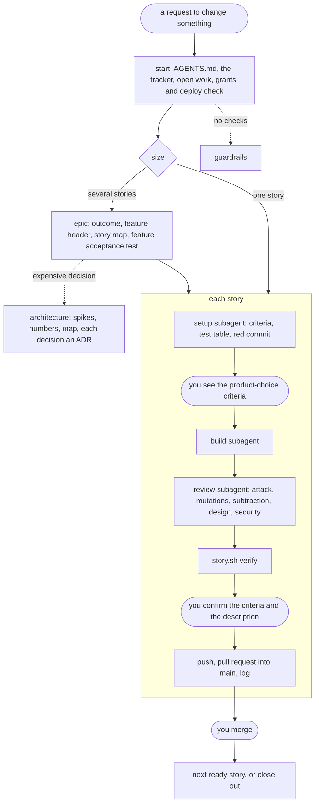

# build like an engineer

**Well-understood engineering practice, run *with* you by an agent rather than recited at you.**

None of this is new. Framing the problem before solving it, stating the contract before building against it, walking how a thing breaks by accident and then on purpose, knowing what you cannot undo: this is ordinary engineering discipline and most of it predates the tooling by decades. What is new is an agent that can hold all of it at once and walk it with you.

The workflow is derived from two podcast episodes, and most of what is specific rather than generic in here traces back to one of them:

- **[Florian Buetow on Beyond Coding](https://www.youtube.com/watch?v=W1uG25of2t0)** with Patrick Akil, 10 June 2026. Code review as the bottleneck once agents write the code, and shaping the environment so corrections become rules instead of repeat conversations.
- **[Dex Horthy on The Pragmatic Engineer](https://www.youtube.com/watch?v=Usufn8IQJgw)** with Gergely Orosz, 15 July 2026. Context engineering, why prose specs drift out from under you, and slicing sized to what a human will actually read.

The plugin is four skills. Plain Markdown, no build step, nothing to compile.

| Skill | Fires on |
|---|---|
| `deliver` | any change to code that exists: "add X", "fix the bug where X", "X is broken", "build story X"; turning work into stories: "I have an idea", "break this epic down", "write the acceptance criteria"; "work through this epic", "what should I pick up next", "pick up where we left off", "write the PR description" |
| `architecture` | "let's build this" in an empty repository, "how should this be structured", "should I use X or Y", "write an adr", "snapshot the architecture", "spike this", "is X feasible", "start a project from a template" |
| `guardrails` | "write AGENTS.md", "get this repo ready for agents", "set up guardrails", "we have no linting", "add a rule", "the agent keeps making this mistake" |
| `reviewing` | "review PR 412", "review what you built", "security review", "review this epic", "give me feedback", "poke holes in this" |

Session handoff lives in the separate [context](../context/) plugin. Plugins are independent, so nothing in SDLC calls it.

Version 12 cut the plugin from eight skills and 2,675 lines to four skills and about 1,200. The eight skills named each other 209 times, references loaded references three levels deep, and one story ran eleven subagents, five of them for review. Now hand-offs run one way (`deliver` may call `architecture` or `guardrails`), each subagent gets one self-contained prompt file, and the steps a program can do are scripts: `story.sh verify` rebases, checks the accepted tests are unchanged and runs the check command, and a push guard holds a story on the machine until the user has confirmed its criteria.

## Three convictions

**Most things do not need to be built.** Every feature is a permanent liability with a running cost. So framing asks what the user will do differently once this ships, and when the answer is already possible in this system or off the shelf, that is the answer. "Do not build it" is a real outcome, and it is recorded as an ADR, because no later step runs to catch it.

**Most requests are not well thought through, including the ones that sound settled.** A decided-sounding one-liner is the normal shape of an unsettled ask. Requests arrive naming a mechanism instead of a need. So the first move is reading the request, not answering it.

**The failing test is the unit of account.** A settled constraint becomes a complete failing test before any implementation exists, and that does not scale with the size of the change. A one-line fix still gets a test.

---

# The workflow


```mermaid
flowchart TD
    REQ([a request to change something]) --> ST[start: AGENTS.md, the tracker, open work, grants and deploy check]
    ST --> SZ{size}
    SZ -- several stories --> EP[epic: outcome, feature header, story map, feature acceptance test]
    EP -. expensive decision .-> ARC[architecture: spikes, numbers, map, each decision an ADR]
    EP --> STORY
    SZ -- one story --> STORY

    subgraph STORY [each story]
      SET[setup subagent: criteria, test table, red commit] --> SHOW([you see the product-choice criteria]) --> BLD[build subagent] --> REV[review subagent: attack, mutations, subtraction, design, security] --> VER[story.sh verify] --> OK([you confirm the criteria and the description]) --> PR[push, pull request into main, log]
    end

    PR --> MRG([you merge]) --> NEXT[next ready story, or close out]
    ST -. no checks .-> G[guardrails]
```

Two phases. For several stories, the first runs with you once per feature: the outcome, the feature header, the story map and the feature acceptance test, with `architecture` for each decision that costs more than a day to reverse. The second runs once per story. A setup subagent writes the story's criteria, the test table, the failing tests and the red commit; you see only the criteria that record a product choice, plus a count of the rest, and the build starts without waiting. A fresh review subagent attacks the criteria with its own tests, applies every mutation, deletes what no test asked for, checks the design against the latest snapshot, and walks a security checklist. Then `story.sh verify` rebases, checks the accepted tests are unchanged and runs the check command. One message shows what changed in the criteria, the review's result and the pull request description, with one question: confirm and open? Only then is anything pushed. You merge. Reviewer comments are checked against the code, and replies are drafted for you to post. A refactor with no behaviour change needs no criteria. A trivial change is one criterion and one red test. A single story skips the first phase.

**The feature acceptance test.** You write one test for the outcome sentence, through the interface you use, marked strictly expected-to-fail so the suite stays green until the feature is whole. The harness denies that directory to the agent for good. When it passes, the feature is done.

**Parking.** A story waits for you only on: its criteria before the first push; a builder question about what a person sees; a test row that turns out wrong; a product decision nothing records; a deferred architecture decision; the feature acceptance test. Every question is sorted first: facts are looked up, a fact only a colleague knows goes on the issue for that colleague, reversible technical choices are decided and listed, and you get product intent and expensive choices one question at a time. Open questions live on the tracker and are never repeated in chat.

---

# What you end up holding

| Artifact | Where | Fate |
|---|---|---|
| Spike findings | the spike issue's resolution comment, as `Learned` lines | durable; the code is deleted |
| Feature header and story log | the epic's description, and one comment per story | durable, kept after the last story |
| ADR | `docs/adr/architecture/` or `docs/adr/{slug}/` | durable, committed before the code that depends on it |
| Architecture snapshot: what changed, two diagrams, key flows, owners, then storage, failures, code map, decisions | `docs/architecture/snapshots/<date>.md`, pointed at by `AGENTS.md` | durable, never edited; a story that changes the shape writes a new one |
| Architecture summary | `docs/architecture/summary.md` | the user's own words: purpose, ranked qualities, tradeoffs, constraints, risks |
| feature acceptance test | the test tree's `feature-acceptance` directory | durable; written by the user, denied to the agent for the life of the repo |
| `# owner reads:` sections | `CODEOWNERS` | durable; the paths you read on every change |
| Failing tests, then passing | the repo's test tree | durable; the red commit message holds the criteria and the table |
| Rules and contracts | the repo, via `guardrails` | durable, added to when a bug's `Not caught by` names a gap |
| Pull request body | the remote | durable; the one place a stranger can read what a story did and why |

There is no spec and no design document. Those paths are the defaults; tell the agent in conversation if your repo keeps things elsewhere.

## Why the split exists

Everything durable is written in a language that can be checked. Everything written in prose is either thrown away or kept short enough to reread.

Prose and code become two sources of truth and drift apart. A rule that executes cannot drift, because a violation fails the build. So the constraints the conversation carried are promoted into tests, guardrails and architectural tests, and the conversation itself goes.

The ADR is the exception, and it is one for a specific reason: it makes no claim about what the system currently does, so there is nothing for it to drift from. It says what was true at a moment and why a door was closed. What it records, the alternatives that lost and the assumptions the decision rests on, is not recoverable from the code and cannot be regenerated the way research can.

The tracker is the other exception, and it is kept small on purpose: an epic description under 15 lines and one log comment per story. At close-out every unpinned `Learned` line is promoted to a test, an ADR or an `AGENTS.md` line, so nothing the log knows lives only in a comment.

This is also why the red commit message carries the criteria and the table verbatim. The reason a number is 100 rather than 150 has to survive the conversation that settled it.

---

# The skills around the loop

**`guardrails` prepares a codebase.** It writes `AGENTS.md`, the one file every session reads, from a short interview and the repository itself. Then it sets up the checks, language agnostic: fourteen slots, what a filled slot has to do, and which of three layers it fires in (every edit, turn end, commit and CI), leaving the tool to the model. What it carries is what the model gets wrong by default: the placement rule in seconds, the settings that are decisions rather than defaults, watching each check fail once, and loop safety wired before the checks. Each rule goes to the first place that holds: a program, then a path-scoped rule file, then one line in `AGENTS.md`. On brownfield, rules land by one of three choices (new files only, a cleanup of its own, or a ratchet); adding rules and leaving them red is not one.

**`architecture` decides and records.** It spikes each untried crossing, drafts the numbers for you to correct, draws the process, module and flow tables, and puts each expensive decision to you one at a time, asking for your pick before its own. Each answer is an ADR written the moment it is made, with `Alternatives rejected` and `Detector`. It also stands a new repository up from a template with `scaffold.sh`, and runs spikes: one question, a timebox, findings recorded as they surface, code deleted.

**`reviewing` reviews anything already made.** A pull request or a diff an agent built (what it lands on, what the tools reported, the five things no tool reports, a security checklist), an existing epic, or work you made (every point sorted into wrong, unverified, shape or preference, with the rewrite left to you). A second agent tries to refute every finding before it is reported. Reviewing your own work is the manual-flying practice the loop no longer forces.

**Session handoff lives in the [context](../context/) plugin** as the `handing-off` skill.

---

# Why not a prose spec

This started as an attempt to address the shortcomings of spec-driven development, where planning and specification are done up front and reviewed before being handed to an agent to implement.

A lot of people call that waterfall in disguise. I don't fully agree, but the pitfalls are real:

- A spec does not guarantee results. Hand the same spec to different models and get different implementations. The spec becomes an aspiration, not a contract.
- Reviewing a spec takes more cognitive effort than reviewing the code it produced. It is easier to read the diff and run the tests than to match every requirement to the code it was supposed to produce.
- A thousand-line Markdown file gets produced for a twenty-line change.
- Specs go stale quickly and confuse the agent. A detail that was relevant at authoring time is still there three features later, and the agent anchors on it as a constraint.
- A hundred specs sitting in a repo have to be read manually to avoid contradicting them.
- Most spec frameworks are heavy on ceremony, unfriendly to brownfield, and awkward to work with in an agile fashion.

We already have specs. They are tests. Deterministic pass or fail, and they do not lie about the code. What they cannot carry is the **why**, and that is what the ADR is for.

## Where tests stop

A behavioural test binds what the system does at one moment. It cannot fail when the design decays, because decay has no wrong answer on the day it is introduced. The imports still resolve, the suite still passes, and the bill arrives three months later as a change that touches nine files instead of one.

So the loop has three places for a constraint rather than one. Behaviour gets a row in the test table. Structure gets a rule that executes: dependency direction, boundary membership, ownership, a budget, wired through whatever the repo already runs by `guardrails`. And what nothing can reach is written down as exactly that, under what the pull request says is deferred or as an ADR, and observed through the story's signal once deployed.

That leaves the decision itself, which neither reaches. The ADR's "What it doesn't buy" section carries it: what must stay true, and what would make this wrong. That is the trigger for revisiting. A test asserts that one hop of delegation works; only the ADR says that one hop was an assumption rather than a requirement.

## What the research says, including where it disagrees

Some of this is better evidenced than I expected, and some of it cuts against the idea. Both are here.

**"Tests don't lie" is too strong.** Tests encode whatever the spec says, *including its errors*, and they do it invisibly. Mund et al. injected one subtly wrong requirement into a real 21-page industrial spec and asked 41 people to derive test cases from it: **zero detected the defect and zero correct test cases were produced**, even in the group given a briefing that stated the correct behaviour. Tests don't lie about the code. They will happily lie about the intent.

**Deriving expected values independently is not a style preference.** It is what aviation certification requires, and DO-248A states the mechanism: "It is a natural tendency to consider outputs of the actual code as the expected results. **This bias cannot occur when expected outputs are determined by analysis of the requirements.**" Using the code as the oracle contaminates the oracle. The same document concedes that requirements-based testing cannot evidence the absence of *unintended function*, which is why the review reads the diff for what crept in rather than trusting a green suite.

**The honest limit on absence.** A test refutes; it cannot confirm. Refuting a safety property ("X never happens") takes one failing execution; confirming it means quantifying over every execution there is. That is a proved result, not a budget problem, and it is why "no unauthorized path" ends up as a permanent gap checked against production rather than a test that pretends to settle it.

**The biggest risk to this approach is staleness, and it has a number.** In a study of Ruby projects, executable scenarios and production code co-evolved in only **~37%** of cases, and where they did, the spec changed *after* the code. A green test suite is indistinguishable from a suite full of requirements that expired. That is what the ADR's "What it doesn't buy" section exists for: a constraint with no recorded invalidation condition dies in silence while the tests keep passing.

**The closest thing to prior art mostly failed, and it is worth knowing why.** Specification by Example is the same bet, and Gojko Adzic's own ten-year retrospective (514 respondents, recruited from his advocacy channels) concluded that "the idea of specifications and tests in a single document didn't really work out." Only 12% kept text files in version control as the source of truth; 26% of business representatives "mostly do not care about the examples"; 61% of BDD practitioners in a separate survey found duplication made specs hard to extend. But read what failed: a **separate natural-language layer** maintained alongside the code for stakeholders who turned out not to read it. That layer is the thing this plugin deletes. The finding that only 12% kept the living document in version control is, if anything, evidence for the choice.

**And the ceiling that applies to everyone.** Naur: "program revival, that is reestablishing the theory of a program merely from the documentation, is strictly impossible." That applies to prose specs exactly as much as to tests. So the claim here is not that tests capture what prose cannot. It is that **these two artifacts fail differently**, tests rotting loudly and prose rotting quietly, and neither one reconstitutes the theory in someone's head. The ADR is a hedge against one failure mode, not a solution to the problem.

**One thing to hold this methodology to.** Every reported failure of BDD gets answered with "that isn't BDD, you did it wrong." A technique whose failures are always the practitioner's fault has no failure conditions, so no evidence can ever count against it. If this approach costs you more than it returns, that is a result about the approach.

## Where the workflow itself comes from

The stage structure is derived in `research/combined-development-strategy.md`, which merges the two episodes linked at the top:

- Florian Buetow on **Beyond Coding**, 10 June 2026: [YouTube](https://www.youtube.com/watch?v=W1uG25of2t0), [Pocket Casts](https://pca.st/episode/ab84ca98-407b-4445-b08b-2d7e31c12a30)
- Dex Horthy on **The Pragmatic Engineer**, 15 July 2026: [YouTube](https://www.youtube.com/watch?v=Usufn8IQJgw)

Every line there states why it is in, and the two conflicts are resolved at the point they arise. Transcripts and derivations live in `research/`, which is never loaded by any skill. Neither guest had anything to do with this plugin, and any misreading of them is mine.

Both arrive independently at the same structural claim, that feature work and environment work are separate projects running in parallel. That is why `guardrails` is a skill of its own rather than a step in the change loop.

The two conflicts are worth naming because the resolutions shaped the skills:

- **Does a human read the code?** Buetow says interrogating the agent can replace reading it. Horthy ran the lights-off version for four months and shut it down, with a specific bug and a recovery cost. Resolved toward Horthy: the interrogation stays as the way new rules get discovered, the substitution does not. This is why every story is one pull request under one screen of description, and why the review is never self-audit.
- **Do the documents persist?** Buetow keeps specs; Horthy throws them out because prose and code become two sources of truth. Resolved toward Horthy on prose and toward Buetow on rules: the prose is deleted and the constraints it carried are promoted into things that execute.

`research/example_artifacts.md` is the companion, showing what each artifact looks like and how long it lives.

Neither source covers what happens when a feature is removed, what to do when a feature needs a boundary you drew wrong, or when to retire a rule that has stopped earning its slot. Those gaps are still open.

## Where the hands go

The split between what the user does and what the agent does follows how an airline crew works with an autopilot. The pilot hand-flies the takeoff and the landing and sets the autopilot's targets for the cruise; the autopilot never chooses the altitude. In the loop, the user confirms the outcome, the story list, the architecture tables and the first decisions up front, confirms each story's criteria before anything is pushed, answers the builder's questions about what a person will see, and merges each pull request. Between those points the agent runs the failing tests, the build subagent, the review subagent, the full suite and the pull request. The loop sorts each question before asking it: it looks up facts, parks a fact only a colleague knows on the issue for that colleague, decides reversible technical choices alone and lists them, and asks the user only about product intent and choices expensive to reverse. It asks one question per message as multiple choice, runs one story at a time unless `AGENTS.md` says otherwise, keeps open questions on the tracker instead of repeating them in chat, and shows at the criteria gate only the criteria that record a product choice.

That sorting comes from field use. Sessions that asked seven questions at once, re-listed them after every subagent, and ran four stories in parallel left the user answering "you do it". Working memory holds about four items (Cowan, 2001). Repeated alerts get ignored: clinicians' acceptance fell 10% for every 5% rise in repeated alerts (Ancker et al., 2017). The amount of oversight an AI tool needs was the strongest predictor of fatigue in BCG's 2026 survey of 1,488 workers. For expensive decisions, `architecture` asks which alternative the user would pick before it gives its own view. In Anthropic's 2026 trial, developers who asked the AI conceptual questions scored 65% or higher on comprehension, and those who handed off generation scored below 40%. So the one question the user answers per decision is also what keeps their model of the system current, and no separate quiz is needed. Across three transcripts (two personal, one work), 13 criteria gates showed 105 criteria; the user edited none, and every criterion later found wrong had been approved unedited. Agile sources place edge and abuse cases with the developers and agreement on the rules and a few key examples (Jeffries; Keogh; Adzic, "Focus on key examples"). So the gate shows only criteria that record a product choice, the story builds while they wait, and confirmation comes before the first push. For the same reason the user writes `docs/architecture/summary.md` in their own words: purpose, three ranked qualities with numbers, tradeoffs and constraints. The agent settles smaller choices the ranking decides. Snapshots open with what changed, two small diagrams and three to five flows traced end to end, since programmers build a model of control flow before one of structure (Pennington, 1987), and trace visualisation cut comprehension time 22% and raised correct answers 43% (Cornelissen et al., 2009). The reference tables follow. The summary also lists the three most likely failures, and each snapshot names who owns each process, store and outside system, since an architect is expected to know the risks and the owners (Fairbanks; Reilly, *The Staff Engineer's Path*).

Three findings from that field shaped specific rules:

- **Bainbridge, "Ironies of Automation" (1983).** Automation takes the routine part of a task and leaves the human the hard part, with less practice at it. FAA SAFO 13002 (2013) asks airlines to schedule manual flying so the skill stays current. The practice is the user writing code, a design or a fix idea by hand and running `reviewing` on it; the `deliver` loop never forces it, since a forced exercise in the middle of a delivery is an interruption, and the loop is for delivering.
- **Asiana 214 (NTSB, 2013).** The crew flew an approach assuming the autothrottle held speed while it sat in a mode that did not. This is why the proposal lists what it assumes before the build, for the pull request's reviewer to check.
- **The stabilized-approach gate.** An approach that fails fixed criteria at a fixed height is abandoned without debate. This is why a builder that reports red, or touches a path outside its story, is reset to the red commit and reissued once, and the story is split after the second failure.

---

# How it runs

Say what you want in ordinary language.

- **Anything that changes a system**: "add X", "fix this bug", "remove the Y feature".
- **Half-formed**: "I'm thinking about Y", "what's the best way to Z", "should we move to A".
- **When nobody knows yet**: "just build me a quick version", "I want to try something".
- **Mid-flight**: "write the tests for this", "build the next story", "review my diff".
- **After it ships**: "we shipped X, is it working".
- **On a repo with no checks**: "set up guardrails", "we have no linting".
- **At a session boundary**: "write a handoff", "I'm running low on context".

Judgment calls go to you. The skills surface the decision, the failure mode or the coverage gap concretely, and you disposition it. The model does not decide for you, and where you ask it to choose it says what it would pick and marks that as its read rather than the answer.

**Every sentence has to earn its place by one test: does it change what you do next?** That cuts the preamble announcing what is about to happen, the derivation behind a result you can take on trust, the reasons you supplied in the first place, and the second argument for a point the first already carried. The answer leads, the question closes. Several findings arrive as one line each, for you to pick which to open, rather than being worked through in order. A document or a diff that was just written is named and located rather than reproduced. The pictures are the exception to the volume rule: those go up, not down.

**Each subagent's model and effort are fixed in its agent file.** Setup and review run on Opus at high effort, and build on Opus at medium. Refute runs on Fable at medium, so a finding is checked by a different model from the one that found it. The pull request description, fact lookups and the worker run on Sonnet at medium.

# Installing

**Claude Code:**

```bash
/plugin marketplace add DaveBben/davebben-skills
/plugin install SDLC@davebben-skills
```

The four skills surface under their own names.

The plugin also installs two hooks. They print `hooks/writing.md`, the writing rules every reply and document follows, into every session and every subagent, in every project where the plugin is enabled. That costs about 900 tokens per session and per subagent.

It also installs seven named agents, one per `deliver` subagent step: `SDLC:lookup`, `setup`, `build`, `review`, `refute` and `description`, plus `worker` for any other task `deliver` delegates that changes no code. Each agent file is that step's whole prompt, at `skills/SDLC/deliver/agents/`, linked into the plugin by the `agents` symlink. Other agents read the same files as prompts for general subagents. Each file's frontmatter sets that step's model and effort.

**Any other agent** (Codex, Cursor, Windsurf, and more), via the [`skills` CLI](https://github.com/vercel-labs/skills):

```bash
npx skills add DaveBben/davebben-skills --skill deliver
```

Other agents do not run the hooks, so they get no writing rules. Paste `plugins/SDLC/hooks/writing.md` into the agent's own instructions file to have them.

Swap in `guardrails` or `architecture`, or `--all` for every skill in the repo. The canonical `SKILL.md` files live at `skills/SDLC/` in the repo root.

MIT.
