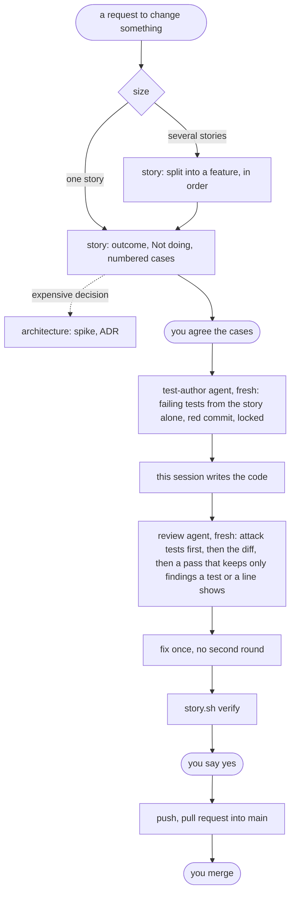

# build like an engineer

**User stories, failing tests first, one fresh review. Every other step was measured, and cut when it did not pay.**

The plugin is five skills. Plain Markdown, no build step, nothing to compile.

| Skill | Fires on |
|---|---|
| `story` | turning work into user stories: "write a story for X", "write the acceptance criteria", "break this down", "I have an idea", "turn this PRD into stories", "review these stories", "what should I pick up next" |
| `deliver` | any change to code that exists: "add X", "fix the bug where X", "X is broken", "build story X", "build the next story", "refactor X", "pick up where we left off" |
| `architecture` | "let's build this" in an empty repository, "how should this be structured", "should I use X or Y", "write an adr", "snapshot the architecture", "spike this", "is X feasible" |
| `guardrails` | "write AGENTS.md", "get this repo ready for agents", "set up guardrails", "we have no linting", "add a rule", "the agent keeps making this mistake" |
| `review-code` | "review PR 412", "review this merge request", "review my code", "review what you built", "security review", "give me feedback", "poke holes in this" |

Session handoff lives in the separate [context](../context/) plugin. Plugins are independent, so nothing in SDLC calls it.

# The workflow


```mermaid
flowchart TD
    REQ([a request to change something]) --> SZ{size}
    SZ -- several stories --> SP[story: split into a feature, in order]
    SZ -- one story --> ST[story: outcome, Not doing, numbered cases]
    SP --> ST
    ST -. expensive decision .-> ARC[architecture: spike, ADR]
    ST --> GO([you agree the cases])
    GO --> TA[test-author agent, fresh: failing tests from the story alone, red commit, locked]
    TA --> BLD[this session writes the code]
    BLD --> REV[review agent, fresh: attack tests first, then the diff, then a pass that keeps only findings a test or a line shows]
    REV --> FIX[fix once, no second round]
    FIX --> VER[story.sh verify]
    VER --> OK([you say yes]) --> PR[push, pull request into main]
    PR --> MRG([you merge])
```

1. **The story.** An outcome, a `Not doing` list and numbered cases with concrete values. The agent asks only where two readings of the request lead to different cases, and decides and lists everything else.
2. **Failing tests from a fresh agent.** The `test-author` agent gets the story and the repository, not the chat and not any code for the change, and commits the failing tests as the red commit. Those tests, and every test that existed before, are locked: a commit that changes one is refused, whichever tool made the edit. A test the code cannot satisfy is a stop, reported to you.
3. **The code.** The session writes it until the suite is green, changing only what the cases need.
4. **One fresh review.** The `review` agent writes attack tests from the story before it reads the diff, then reads the diff, then checks each of its own findings and keeps only those a red test or a cited line shows. The `security` agent follows only when the diff adds outside input, a credential, auth, payments, cryptography or memory handled by hand.
5. **Fix once.** Confirmed findings become failing tests, then fixes. A finding the fix does not settle comes to you as a question; there is no second review round.
6. **You confirm.** One message with the cases, the review's result and the pull request description. Nothing is pushed before your yes, and the agent never merges.

A refactor needs no story. A trivial fix is one case and one failing test. A tracker is optional: with a `Backlog:` line in `AGENTS.md`, stories are issues; without one, a story lives in the chat and the pull request, and a feature in `docs/stories/<slug>.md`.

# Why it looks like this

Version 16 is a rewrite from an experiment, kept in [research/sdlc-16-evidence](../../research/sdlc-16-evidence/). Five real changes merged upstream after the model's training cutoff (go-chi/chi, python-attrs/attrs, urfave/cli, colinhacks/zod and ggml-org/llama.cpp) were rebuilt as stories and given to Opus 5.5 three ways, graded by the upstream pull request's own tests and a blind judge:

* **Plain prompting** passed 88% of the hidden tests on the four smaller tasks, at about $1 and 4 minutes a run.
* **A one-paragraph "careful" prompt** (tests first, then a fresh-subagent review) passed 90% and ranked best with the judge, at about $2.50 and 10 minutes.
* **SDLC 15** passed 86% and ranked worst, at about $10 and 50 minutes. With every test file removed from the diffs, its rank stayed the same: the judge was marking down unrequested machinery in the source, such as a shadow routing table for a fix plain prompting made in 15 lines.

Follow-up runs then tested each mechanism on its own:

* **Kept, because it measured well:**
  * **One review with a verification pass:** best judge rank of four review designs. No review was clearly worst, and a second round cost more and swung between tasks.
  * **Locked tests with a stop-and-report rule:** in three llama.cpp runs, no accepted test changed after the red commit, against up to 139 changed lines in runs without it.
  * **A fresh test author:** the judge scored its tests higher on both tasks it judged (cli and zod). Its overall rank was mixed, worse on cli and better on zod, and it cost about $0.50 to $1 more a run.
* **The stories carry what the agent cannot know.** Given only the original issue text, every arm lost hidden tests (cli 7/8 to 5/8), and an agent writing its own case list recovered none of them. So the `story` skill puts the user's answers into concrete cases, and asks only where readings diverge.
* **Cut, because it measured nothing or cost more:**
  * the refute agent on another model, separate setup, build and refactor agents, and the second review round;
  * the mutation pass: no gain, about $1.50 more a run;
  * the `story.sh` step machine and its 365-line hook script;
  * the tracker as a requirement;
  * the epic's release line and owner parking;
  * the user's core and sketch turns;
  * writing rules injected into the SDLC subagents, which only the session reads.
* **Guardrails stays.** On llama.cpp, AGENTS.md alone, hooks alone and both changed no measured outcome. The hooks fired on every shell command and blocked nothing. The edit hooks fired 10 to 12 times a run while the two shell-command hooks fired 162 to 268 times, because the model wrote most files through the shell, so every rule that must hold now also runs at commit or turn end. `EVIDENCE.md` cites 2026 measurements where prose instructions were ignored and a tool-enforced check was not.

A first headless run of this version passed 7 of 8 hidden tests on cli and 4 of 6 on zod, the same as the other arms, at $3.58 and $3.07 and 15 and 11 minutes; SDLC 15 took $4.72 and $9.67 and 22 and 46 minutes on the same tasks.

`EVIDENCE.md` matches every SDLC 15 mechanism to published evidence for 2026-generation models. `FOLLOWUP.md` has each follow-up experiment's numbers. Two caveats apply throughout:

* **Small samples:** two or three runs per arm.
* **Machine judging:** an LLM judge, which a human ranking has not yet checked.

# What you end up holding

| Artifact | Where |
|---|---|
| Stories | the tracker's issues, or the chat and the pull request; a feature in `docs/stories/<slug>.md` |
| Failing tests, then passing | the repository's test tree; the red commit's message holds the test list |
| ADRs and architecture snapshots | `docs/adr/` and `docs/architecture/snapshots/`, by the `architecture` skill |
| Rules and checks | the repository, by the `guardrails` skill |
| Pull request description | the remote: what changed, why, and how to verify it |

# Installing

**Claude Code:**

```bash
/plugin marketplace add DaveBben/davebben-skills
/plugin install SDLC@davebben-skills
```

The five skills surface under their own names.

The plugin also installs hooks:

* **Writing rules:** two hooks print `hooks/writing.md`, the writing rules every reply and document follows. One prints them into every session. The other prints them into each general subagent, which may write a document you read, such as an ADR. They cost about 900 tokens each time.
* **The guard:** a third hook runs deliver's `scripts/guard.py` before a shell command containing `git` or `merge`. It refuses a merge, a push or pull request before you confirm the story, and a commit that changes a locked test.

It installs three named agents: `SDLC:test-author`, `SDLC:review` and `SDLC:security`. Each agent file is that agent's whole prompt, at `skills/SDLC/agents/`, linked into the plugin by the `agents` symlink. `deliver` runs `review` and `security` on its stories and `review-code` on merge requests, your own code and designs, so every review is the same review.

**Any other agent** (Codex, Cursor, Windsurf, and more), via the [`skills` CLI](https://github.com/vercel-labs/skills):

```bash
npx skills add DaveBben/davebben-skills --skill deliver
```

The `deliver` and `review-code` skills launch subagents whose prompts live in `skills/SDLC/agents/`, beside the skill folders rather than inside one. The `skills` CLI copies skill folders, so also copy `skills/SDLC/agents/` into the folder that holds the installed skills, as a sibling named `agents`. Other agents do not run the hooks, so they get no writing rules and no guard. Paste `plugins/SDLC/hooks/writing.md` into the agent's own instructions file to have the rules.

Install `story`, `deliver`, `architecture`, `guardrails` and `review-code` together, or `--all` for every skill in the repo. The canonical `SKILL.md` files live at `skills/SDLC/` in the repo root.

MIT.
