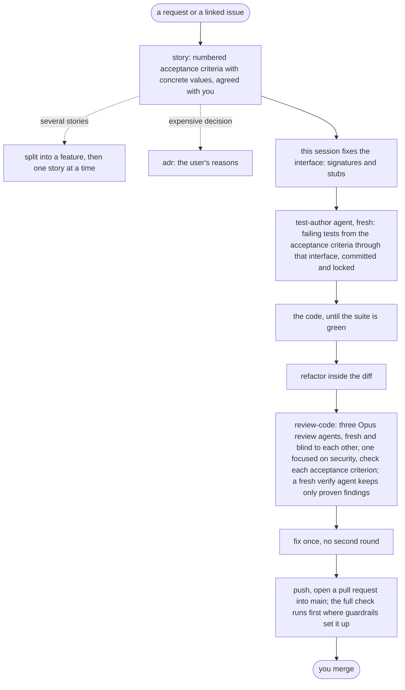

# build like an engineer

**User stories, failing tests first, one fresh review. Every other step was measured, and cut when it did not pay.**

The plugin is six skills. Plain Markdown, no build step, nothing to compile.

| Skill | Fires on |
|---|---|
| `story` | any change to code that exists, and turning work into user stories: "add X", "fix the bug where X", "X is broken", "build story X", "refactor X", "pick up where we left off", "write a story for X", "break this down", "I have an idea", "turn this PRD into stories", "review these stories", "what should I pick up next" |
| `adr` | "write an adr", "record the why", "should I use X or Y", "we will accept that risk", "let's go with X instead of Y" |
| `spike` | "let's prove this works first", "prototype this", "build a demo", "is X feasible", "try a few approaches and see", "do a spike" |
| `orient` | "write AGENTS.md", "write a CLAUDE.md", "our CLAUDE.md is too long", "orient yourself" |
| `guardrails` | "add a rule", "never do X", "the agent keeps making this mistake", "set up guardrails", "we have no linting", "which of our CLAUDE.md rules could be checks" |
| `review-code` | "review PR 412", "review this merge request", "review my code", "review what you built", "security review", "give me feedback", "poke holes in this" |

Session handoff lives in the separate [context](../context/) plugin. Plugins are independent, so nothing in SDLC calls it.

# The workflow


```mermaid
flowchart TD
    REQ([a request or a linked issue]) --> CASES[story: numbered acceptance criteria with concrete values, agreed with you]
    CASES -. several stories .-> SP[split into a feature, then one story at a time]
    CASES -. expensive decision .-> ARC[adr: the user's reasons]
    CASES --> IF[this session fixes the interface: signatures and stubs]
    IF --> RED[test-author agent, fresh: failing tests from the acceptance criteria through that interface, committed and locked]
    RED --> BLD[the code, until the suite is green]
    BLD --> REF[refactor inside the diff]
    REF --> REV[review-code: three Opus review agents, fresh and blind to each other, one focused on security, check each acceptance criterion; a fresh verify agent keeps only proven findings]
    REV --> FIX[fix once, no second round]
    FIX --> PR[push, open a pull request into main; the full check runs first where guardrails set it up]
    PR --> MRG([you merge])
```

1. **The story.** The agent writes the request as a story, or reads a linked issue: As a / I want / so that, numbered Given/When/Then acceptance criteria with concrete values, edge cases included, and an `Out of scope` list. It asks only where two readings lead to different acceptance criteria, decides and lists everything else, and builds once you say go.
2. **Interface, then failing tests from a fresh agent.** The session writes the signatures the change needs as stubs, so the design stays with the builder. The `test-author` agent, which never sees the plan or any implementation, writes one test per acceptance criterion through those stubs, confirms each fails for the stated reason, and commits them alone. Those tests, and every test that existed before, are locked: a commit that changes one is refused, whichever tool made the edit. A test the code cannot satisfy is a stop, reported to you.
3. **The code, then a refactor.** The session writes it until the suite is green, changing only what the acceptance criteria need, then tidies the diff with every test green.
4. **One fresh review, through `review-code`.** Three `review` agents, blind to each other, each check whether each acceptance criterion still holds, backing each finding with a failing test or a cited line, searching hardest on one focus each: correctness, tests and production, or security. A fresh `verify` agent, which never sees their reasoning, keeps only the findings a red test or a cited line proves.
5. **Fix once.** Confirmed findings become failing tests, then fixes. A finding the fix does not settle comes to you as a question; there is no second review round.
6. **Push and open the pull request.** Where `guardrails` set it up, the full check, acceptance tests included, runs before the pull request opens and refuses it on a failure. The agent reports the result and every choice it made without you, and never merges.

A refactor needs no new acceptance criteria. A tracker is optional: paste an issue's link and the agent reads it; without one, a story lives in the chat and the pull request, and a feature in `docs/stories/<slug>.md`.

# Why it looks like this

Version 16 is a rewrite from an experiment, kept in [research/sdlc-16-evidence](../../research/sdlc-16-evidence/). Five real changes merged upstream after the model's training cutoff (go-chi/chi, python-attrs/attrs, urfave/cli, colinhacks/zod and ggml-org/llama.cpp) were rebuilt as stories and given to Opus 5.5 three ways, graded by the upstream pull request's own tests and a blind judge:

* **Plain prompting** passed 88% of the hidden tests on the four smaller tasks, at about $1 and 4 minutes a run.
* **A one-paragraph "careful" prompt** (tests first, then a fresh-subagent review) passed 90% and ranked best with the judge, at about $2.50 and 10 minutes.
* **SDLC 15** passed 86% and ranked worst, at about $10 and 50 minutes. With every test file removed from the diffs, its rank stayed the same: the judge was marking down unrequested machinery in the source, such as a shadow routing table for a fix plain prompting made in 15 lines.

Follow-up runs then tested each mechanism on its own:

* **Kept, because it measured well:**
  * **One review with a verification pass:** best judge rank of four review designs. No review was clearly worst, and a second round cost more and swung between tasks.
  * **Locked tests with a stop-and-report rule:** in three llama.cpp runs, no accepted test changed after the red commit, against up to 139 changed lines in runs without it.
* **The stories carry what the agent cannot know.** Given only the original issue text, every arm lost hidden tests (cli 7/8 to 5/8), and an agent writing its own acceptance criteria list recovered none of them. So the `story` skill puts the user's answers into concrete acceptance criteria, and asks only where readings diverge.
* **The interface split, after 16.0.0:** a test writer shown buggy code wrote tests that pass the bug 3.84% of the time, against 0.46% when shown fixed code (11 models, Defects4J; arXiv 2607.22883), and an agent's tests for its own repairs lowered its SWE-bench Verified score from 61.2% to 57.3% where another model's tests raised it to 65.3% (arXiv 2609.09133). No study measures who should define the interface, so the session that builds the code defines it, and the fresh `test-author` agent tests through it. The confirm step before a push was dropped.
* **Cut, because it measured nothing or cost more:**
  * the refute agent on another model as it stood in SDLC 15, separate setup, build and refactor agents, and the second review round;
  * the mutation pass: no gain, about $1.50 more a run;
  * the `story.sh` step machine and its 365-line hook script, and later `story.sh` itself;
  * the tracker as a requirement;
  * the epic's release line and owner parking;
  * the user's core and sketch turns;
  * writing rules injected into the SDLC subagents, which only the session reads.
* **Guardrails shrank to rules and two checkpoints.** On llama.cpp, AGENTS.md alone, hooks alone and both changed no measured outcome. The hooks fired on every shell command and blocked nothing, and the edit hooks saw 10 to 12 of the writes because the model wrote most files through the shell. So guardrails now runs `./check` once when Claude ends its turn and `./check --full` before it opens a pull request, and turns each rule into a check where a program can decide it. `EVIDENCE.md` cites 2026 measurements where prose instructions were ignored and a tool-enforced check was not.

* **The review, rebuilt from outside measurements after 16.0.0.** The experiment above did not test how many finders to run or whether the check should be a separate agent; these studies did:
  * **Ask whether each acceptance criterion still holds.** Asking a model whether a stated claim about the code still holds gave 0.79 precision; asking whether the diff preserves behaviour gave 0.29 against a 0.25 base rate, from Claude Haiku to Opus 5 (arXiv 2609.25130).
  * **Give the acceptance criteria, not the description.** Refined pull request descriptions got 32 of 33 vulnerable changes approved, and removing them restored detection in 16 (arXiv 2603.18740); framing text about a task's stakes swayed 33% of verdicts (arXiv 2606.30587).
  * **Several finders, every finding kept for checking.** Ten review runs merged raised recall from 14% to 30% (SWR-Bench, arXiv 2509.01494); passes two to four found 12 to 20 more CVEs, then gains flattened (arXiv 2607.27030). Majority vote scored 0% where the minority was right (arXiv 2602.09341), so a finding counts by its evidence, not its votes.
  * **Three finders, one of them on security, every review.** One security-audit run found about half of what repeated runs found (Cloudflare), and gains flattened after 3 to 5 runs (SWR-Bench; arXiv 2607.27030). Repeats of one model shared 78% of their errors against 32% across model families (arXiv 2609.36958), so each finder searches hardest on a different focus. General reviews under-cover security by 89.5% (Meta, arXiv 2607.29516), while long security-specific prompts and CWE cheatsheets lowered scores (arXiv 2607.13085, 2607.14628), so security is one focus of the shared prompt rather than its own agent. Opus is the model: it had 91.5% precision on vulnerability scans against Sonnet's 62.6%, at a lower cost per session (Snyk VulnBench, arXiv 2606.15762).
  * **A separate checker that does not see the finder's reasoning.** Reviewing its own answers, a model rejected 35% of the correct ones, against 2% for an independent reviewer (arXiv 2609.04270); a verifier stage raised precision from 0.35 to 0.47 (arXiv 2609.15887); a correction checked by running code gained 6 to 26 points where one triggered by the model's doubt lost 3 to 10 (arXiv 2608.14659).

A first headless run of this version passed 7 of 8 hidden tests on cli and 4 of 6 on zod, the same as the other arms, at $3.58 and $3.07 and 15 and 11 minutes; SDLC 15 took $4.72 and $9.67 and 22 and 46 minutes on the same tasks.

`EVIDENCE.md` matches every SDLC 15 mechanism to published evidence for 2026-generation models. `FOLLOWUP.md` has each follow-up experiment's numbers. Two caveats apply throughout:

* **Small samples:** two or three runs per arm.
* **Machine judging:** an LLM judge, which a human ranking has not yet checked.

# What you end up holding

| Artifact | Where |
|---|---|
| Stories | the tracker's issues, or the chat and the pull request; a feature in `docs/stories/<slug>.md` |
| Failing tests, then passing | the repository's test tree; the red commit's message holds the test list |
| ADRs | `docs/adr/`, by the `adr` skill |
| Rules and checks | the repository, by the `guardrails` skill |
| Pull request description | the remote: what changed, why, and how to verify it |

# Installing

**Claude Code:**

```bash
/plugin marketplace add DaveBben/davebben-skills
/plugin install SDLC@davebben-skills
```

The six skills surface under their own names.

The plugin also installs hooks:

* **Writing rules:** two hooks print `hooks/writing.md`, the writing rules every reply and document follows. One prints them into every session. The other prints them into each general subagent, which may write a document you read, such as an ADR. They cost about 900 tokens each time.
* **The guard:** a third hook runs story's `scripts/guard.py` before a shell command containing `git` or `merge`. It refuses a merge, and a commit that changes a locked test.

It installs three named agents: `SDLC:test-author`, `SDLC:review` and `SDLC:verify`. Each agent file is that agent's whole prompt, at `skills/SDLC/agents/`, linked into the plugin by the `agents` symlink. `story` runs `review-code` on each story it builds, as you do on merge requests, your own code and designs, so every review is the same review.

**Any other agent** (Codex, Cursor, Windsurf, and more), via the [`skills` CLI](https://github.com/vercel-labs/skills):

```bash
npx skills add DaveBben/davebben-skills --skill story
```

The `story` and `review-code` skills launch subagents whose prompts live in `skills/SDLC/agents/`, beside the skill folders rather than inside one. The `skills` CLI copies skill folders, so also copy `skills/SDLC/agents/` into the folder that holds the installed skills, as a sibling named `agents`. Other agents do not run the hooks, so they get no writing rules and no guard. Paste `plugins/SDLC/hooks/writing.md` into the agent's own instructions file to have the rules.

Install `story`, `adr`, `spike`, `orient`, `guardrails` and `review-code` together, or `--all` for every skill in the repo. The canonical `SKILL.md` files live at `skills/SDLC/` in the repo root.

MIT.
